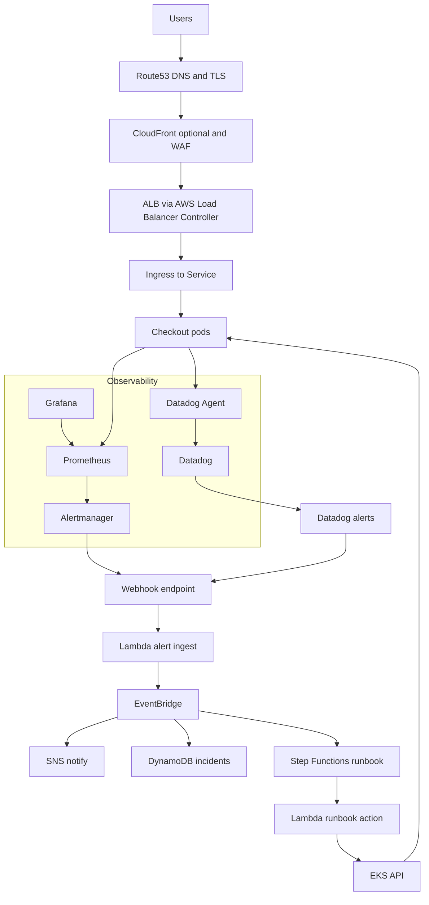

# Event-Driven SRE Platform (Production-style Scaffold)

This repo is a production-minded scaffold for building an event-driven SRE loop on AWS + EKS:
**Detect → Alert → Event → Runbook Automation → Notify → Audit**.

## Architecture

### Mermaid


## What’s included
- Flask “checkout” service with Prometheus metrics + chaos knobs
- Helm chart for the service (Ingress + ServiceMonitor)
- PrometheusRule alerts (latency/errors/down)
- Alertmanager webhook routing template
- Terraform scaffold for event pipeline (API Gateway → Lambda → EventBridge → SNS/DynamoDB/StepFunctions)
- Jenkinsfile skeleton (build/scan/push/deploy)

## What’s intentionally stubbed (you’ll implement next)
- Full EKS/VPC provisioning (you can plug in your preferred Terraform module(s))
- Step Functions “action” tasks (Lambda tasks to scale/restart/flip SSM feature flag)
- Datadog synthetics + monitors as code

## Quickstart (local build)
1) Build the app image:
```bash
docker build -t checkout:local apps/checkout
```

2) Deploy with Helm once your cluster is ready:
```bash
helm upgrade --install checkout helm/checkout -n apps --create-namespace \
  --set image.repository=checkout \
  --set image.tag=local
```

3) Install kube-prometheus-stack:
```bash
helm repo add prometheus-community https://prometheus-community.github.io/helm-charts
helm repo update
helm upgrade --install mon prometheus-community/kube-prometheus-stack \
  -f helm/observability/kube-prometheus-stack-values.yaml \
  -n monitoring --create-namespace
```

## Demo chaos knobs
- Increase latency:
  - set env `LATENCY_MS=400`
- Inject errors:
  - set env `ERROR_RATE=0.05`
- Enable degraded mode:
  - set env `DEGRADED_MODE=true`

---
Generated: 2026-01-29


## Production EKS bootstrap (Terraform + Helm)
> Assumes: AWS CLI, kubectl, helm, terraform installed; and your AWS credentials set.

### 1) Build Lambda zip (for alert ingest)


### 2) Provision VPC + EKS + event pipeline


### 3) Configure kubectl for the new cluster


### 4) Install platform add-ons (ALB Controller, ExternalDNS, cert-manager)


### 5) Install monitoring + the app


### 6) Wire Alertmanager webhook
- Terraform outputs `alert_webhook_url` after apply.
- Put it into: `helm/observability/alertmanager-values.yaml` and redeploy Alertmanager values.

### 7) Provoke an incident (demo)
- Add latency: set Helm value `env.LATENCY_MS=400`
- Or inject errors: set `env.ERROR_RATE=0.05`
- Watch: Grafana + Alertmanager fire; AWS stores incidents in DynamoDB + sends SNS.


## Production EKS bootstrap (bash)
**No options, no shortcuts.** This is the production-grade path.

Prereqs: `aws`, `terraform`, `kubectl`, `helm`, `zip`, `python3`.

1) Bootstrap (build Lambdas, provision AWS/EKS, set kubeconfig)
```bash
bash scripts/bootstrap.sh
```

2) Install platform add-ons (ALB Controller, ExternalDNS, cert-manager)
```bash
bash scripts/install-addons.sh
```

3) Deploy monitoring + alerts + app
```bash
bash scripts/deploy.sh
```

### Wire Alertmanager → AWS
After Terraform apply:
```bash
terraform -chdir=terraform output -raw alert_webhook_url
```
Put that value into `helm/observability/alertmanager-values.yaml` and then upgrade the stack to apply it.

### Important: RBAC mapping for remediation
The runbook action Lambda calls the Kubernetes API. In production you MUST map the Lambda IAM role into `aws-auth`
and grant it a tightly-scoped ClusterRole/RoleBinding (e.g., patch deployments in `apps` only).

### Demo: provoke an incident
- Latency: set Helm value `env.LATENCY_MS=400`
- Errors: set `env.ERROR_RATE=0.05`

Watch the loop:
Grafana/Alertmanager fires → API Gateway → alert_ingest Lambda → Step Functions → runbook_action Lambda patches deployment.
