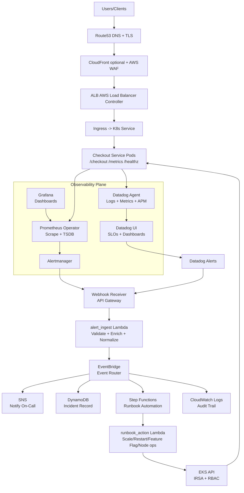

# Event-Driven SRE Platform

> **Production-grade automated incident response for Kubernetes on AWS**

[](https://www.terraform.io/)
[](https://kubernetes.io/)
[](https://www.python.org/)
[](https://aws.amazon.com/)
[](LICENSE)

An event-driven SRE platform that automates incident response for Kubernetes applications on AWS. Detects issues via Prometheus, routes alerts through an event-driven pipeline, and automatically remediates common problems—reducing Mean Time To Resolution (MTTR) from minutes to seconds.

**Detect → Alert → Event → Runbook Automation → Remediate → Verify → Audit**

---

## Key Highlights

- **Fully Automated Incident Response**: Error rate spikes, pods OOMKilled, or latency increases? The system detects, routes, and remediates automatically in 60-90 seconds.
- **Event-Driven Architecture**: EventBridge decouples alert ingestion from remediation actions, making it easy to add new integrations without code changes.
- **Secure by Design**: IRSA (IAM Roles for Service Accounts) for Kubernetes access—no long-lived credentials. Least-privilege IAM policies throughout.
- **Production-Grade Infrastructure as Code**: 100% Terraform + Helm. Reproducible across environments. GitOps-ready.
- **Comprehensive Observability**: Full audit trail in DynamoDB and CloudWatch. Grafana dashboards for real-time incident monitoring.
- **Chaos Engineering Ready**: Built-in error injection, latency injection, and degraded mode for testing resilience.

---

## Architecture

### High-Level Flow



**📊 For detailed architecture diagrams with security boundaries and data flow, see [docs/architecture/README.md](docs/architecture/README.md)**

---

## Features

### Core Capabilities

- ✅ **Alert Ingestion**: API Gateway webhook receives alerts from Prometheus Alertmanager or Datadog
- ✅ **Event Routing**: EventBridge routes alerts to DynamoDB (audit), SNS (notify), Step Functions (remediate), and CloudWatch (logs)
- ✅ **Automated Remediation**: Lambda functions execute runbook actions via Kubernetes API
  - Enable degraded mode (disable optional features)
  - Scale up deployments (increase replica count)
  - Restart deployments (rolling pod recreation)
  - Drain unhealthy nodes (safe pod eviction)
- ✅ **Incident Tracking**: DynamoDB stores incident history with status, actions taken, and resolution time
- ✅ **Security**: IRSA for temporary credentials, least-privilege IAM, Kubernetes RBAC, encryption at rest and in transit
- ✅ **Observability**: CloudWatch Logs for all Lambda functions, EventBridge event archive for replay, DynamoDB for analytics

### Application Features

- ✅ **Prometheus Metrics**: Request rate, error rate, latency (p50, p95, p99), degraded mode status
- ✅ **Health Checks**: `/healthz` endpoint with configurable liveness and readiness probes
- ✅ **Chaos Engineering Knobs**:
  - `ERROR_RATE`: Inject random errors (0.0-1.0)
  - `LATENCY_MS`: Add artificial latency
  - `DEGRADED_MODE`: Disable optional features (read from SSM Parameter Store)
- ✅ **Unit Tests**: pytest-based tests with >60% coverage for Flask application

### Infrastructure Features

- ✅ **Infrastructure as Code**: Terraform modules for VPC, EKS, event pipeline (Lambda, EventBridge, Step Functions, DynamoDB, SNS)
- ✅ **Helm Charts**: Packaged deployment for checkout service with ServiceMonitor and PrometheusRules
- ✅ **CI/CD Skeleton**: Jenkinsfile for build, security scan (Trivy), push to ECR, deploy to EKS
- ✅ **Security Scanning**: tfsec for Terraform, Trivy for container images

---

## Technology Stack

| Layer | Technology | Purpose |
|-------|------------|---------|
| **Compute** | Amazon EKS (Kubernetes 1.28+) | Container orchestration |
| **Serverless** | AWS Lambda (Python 3.11) | Alert ingestion & remediation actions |
| **Orchestration** | AWS Step Functions | Runbook workflow automation |
| **Event Bus** | Amazon EventBridge | Event routing and fan-out |
| **Storage** | DynamoDB | Incident records & audit trail |
| **Notifications** | Amazon SNS | Email, Slack, PagerDuty integration |
| **Monitoring** | Prometheus + Grafana | Metrics collection, alerting, visualization |
| **API Gateway** | AWS API Gateway | Webhook endpoint for alerts |
| **Secrets** | AWS SSM Parameter Store | Feature flags & configuration |
| **IaC** | Terraform 1.6+ | Infrastructure provisioning |
| **Packaging** | Helm 3 | Kubernetes application deployment |
| **Language** | Python 3.11 | Application & Lambda functions |
| **Web Framework** | Flask + Gunicorn | Microservice HTTP server |
| **Testing** | pytest + coverage | Unit tests |

---

## Quick Start

### Prerequisites

- AWS CLI configured with credentials
- Terraform 1.6+
- kubectl 1.28+
- Helm 3
- Python 3.11+
- Docker (for local build)

### Option 1: Production Deployment (Bash Scripts)

The fastest way to deploy the full platform:

```bash
# 1. Bootstrap: build Lambdas, provision VPC/EKS/event pipeline, configure kubectl
bash scripts/bootstrap.sh

# 2. Install platform add-ons: ALB Controller, ExternalDNS, cert-manager
bash scripts/install-addons.sh

# 3. Deploy monitoring (Prometheus, Grafana, Alertmanager) and checkout app
bash scripts/deploy.sh
```

**Time to deploy**: 20-30 minutes (EKS cluster creation is the bottleneck)

### Option 2: Local Development (Docker + Minikube)

For local testing without AWS:

```bash
# 1. Build the checkout app
docker build -t checkout:local apps/checkout

# 2. Start Minikube with sufficient resources
minikube start --memory=4096 --cpus=2

# 3. Load image into Minikube
minikube image load checkout:local

# 4. Install Prometheus Operator
helm repo add prometheus-community https://prometheus-community.github.io/helm-charts
helm repo update
helm upgrade --install mon prometheus-community/kube-prometheus-stack \
  -f helm/observability/kube-prometheus-stack-values.yaml \
  -n monitoring --create-namespace

# 5. Deploy checkout app
helm upgrade --install checkout helm/checkout -n apps --create-namespace \
  --set image.repository=checkout \
  --set image.tag=local
```

---

## Configuration

### Wire Alertmanager to AWS

After Terraform provisioning, get the webhook URL:

```bash
cd terraform
terraform output -raw alert_webhook_url
# Example: https://abc123def.execute-api.us-west-2.amazonaws.com/prod/webhook
```

Update `helm/observability/alertmanager-values.yaml`:

```yaml
alertmanager:
  config:
    receivers:
      - name: 'sre-webhook'
        webhook_configs:
          - url: 'YOUR_WEBHOOK_URL_HERE'
```

Upgrade Alertmanager:

```bash
helm upgrade mon prometheus-community/kube-prometheus-stack \
  -f helm/observability/kube-prometheus-stack-values.yaml \
  -f helm/observability/alertmanager-values.yaml \
  -n monitoring
```

### Configure IRSA for Kubernetes Remediation

The `runbook_action` Lambda needs RBAC permissions to patch deployments:

```bash
# Create ServiceAccount
kubectl create serviceaccount checkout-remediation -n apps

# Annotate with IAM role (from Terraform output)
kubectl annotate serviceaccount checkout-remediation -n apps \
  eks.amazonaws.com/role-arn=$(cd terraform && terraform output -raw lambda_irsa_role_arn)

# Create Role and RoleBinding
kubectl apply -f k8s/rbac/remediation-role.yaml
```

---

## Demo: Incident Response in Action

**Scenario**: Simulate a production incident where error rate spikes to 10%.

### Step 1: Inject Errors

```bash
kubectl set env deployment/checkout -n apps ERROR_RATE=0.10
```

### Step 2: Watch Alert Fire (30 seconds)

```bash
# Port-forward to Alertmanager
kubectl port-forward -n monitoring svc/alertmanager-operated 9093:9093

# Open http://localhost:9093/#/alerts
# Expected: CheckoutHighErrorRate alert in FIRING state
```

### Step 3: Observe Automated Remediation (60 seconds)

```bash
# Watch Step Functions execution
aws stepfunctions list-executions \
  --state-machine-arn $(cd terraform && terraform output -raw step_functions_arn) \
  --max-results 1

# Expected: New execution in RUNNING state

# Tail Lambda logs
aws logs tail /aws/lambda/runbook-action --follow
# Expected: "Enabling degraded mode... Patching deployment..."
```

### Step 4: Verify Remediation Applied

```bash
# Check SSM parameter updated
aws ssm get-parameter --name /checkout/degraded_mode --query 'Parameter.Value' --output text
# Expected: true

# Watch pods restart
kubectl get pods -n apps -l app=checkout -w
```

### Step 5: Confirm Alert Resolved

```bash
# Check error rate dropped
kubectl port-forward -n apps svc/checkout 8080:80
curl http://localhost:8080/metrics | grep checkout_errors_total
# Expected: Error count stopped increasing

# Check incident record
aws dynamodb scan --table-name sre-incidents --max-items 1 \
  --query 'Items[0]' | jq '.'
# Expected: status=resolved, actions_taken=["enable_degraded_mode"]
```

**MTTR**: ~90 seconds from alert detection to resolution.

**📋 For detailed demo script with troubleshooting, see [docs/DEMO.md](docs/DEMO.md)**

---

## Testing

### Run Unit Tests (Flask App)

```bash
cd apps/checkout
pip install -r requirements-dev.txt
pytest tests/ -v --cov
```

**Expected Coverage**: >60%

### Run Lambda Function Unit Tests

```bash
# alert_ingest Lambda
cd terraform/lambda/alert_ingest
pip install -r requirements-dev.txt
AWS_DEFAULT_REGION=us-east-1 pytest tests/ -v --cov

# runbook_action Lambda  
cd terraform/lambda/runbook_action
pip install -r requirements-dev.txt
AWS_DEFAULT_REGION=us-east-1 pytest tests/ -v --cov
```

**Expected Coverage**: >80%

### Run Integration Tests

```bash
# Set up test environment (requires Docker and LocalStack)
cd tests/integration
chmod +x setup.sh
./setup.sh

# Run end-to-end tests
AWS_DEFAULT_REGION=us-east-1 python -m pytest tests/integration/ -v --cov

# Clean up environment
./cleanup.sh
```

**Expected Coverage**: Complete alert pipeline verification
- Alertmanager webhook → API Gateway → Lambda → EventBridge → Step Functions → remediation

### Run Security Scans

```bash
# Scan Terraform for security issues
tfsec terraform/ --minimum-severity MEDIUM

# Scan Docker image for vulnerabilities
docker build -t checkout:local apps/checkout
trivy image checkout:local --severity HIGH,CRITICAL
```

### Chaos Engineering

Test system resilience by injecting failures:

```bash
# Inject 5% error rate
kubectl set env deployment/checkout -n apps ERROR_RATE=0.05

# Add 500ms latency
kubectl set env deployment/checkout -n apps LATENCY_MS=500

# Watch metrics and alerts
kubectl port-forward -n monitoring svc/mon-grafana 3000:80
# Open http://localhost:3000 (admin / prom-operator)
```

---

## Documentation

- **[Architecture Documentation](docs/architecture/README.md)**: Detailed diagrams, component descriptions, design decisions
- **[Demo Script](docs/DEMO.md)**: Step-by-step demo with exact commands (5-7 minutes)
- **[Interview Guide](docs/INTERVIEW_GUIDE.md)**: Talking points, Q&A, trade-offs discussion
- **[Security Documentation](docs/SECURITY.md)**: IAM policies, RBAC, encryption, best practices
- **[API Documentation](docs/API.md)**: Alert webhook endpoint, request/response schemas

---

## Project Structure

```
.
├── apps/
│   └── checkout/               # Flask microservice with Prometheus metrics
│       ├── app.py              # Main application
│       ├── Dockerfile          # Container image
│       ├── requirements.txt    # Python dependencies
│       └── tests/              # Unit tests (pytest)
├── helm/
│   ├── checkout/               # Helm chart for checkout service
│   │   ├── templates/          # K8s manifests (Deployment, Service, Ingress, ServiceMonitor)
│   │   └── values.yaml         # Default values
│   └── observability/          # Prometheus, Grafana, Alertmanager config
│       ├── kube-prometheus-stack-values.yaml
│       ├── alertmanager-values.yaml
│       └── prometheus-rules.yaml  # Alert definitions
├── terraform/
│   ├── vpc.tf                  # VPC with public/private subnets
│   ├── eks.tf                  # EKS cluster with managed node groups
│   ├── event_pipeline.tf       # API Gateway, Lambda, EventBridge, Step Functions, DynamoDB, SNS
│   ├── lambda/
│   │   ├── alert_ingest/       # Webhook handler Lambda
│   │   │   └── handler.py
│   │   └── runbook_action/     # Kubernetes remediation Lambda
│   │       └── handler.py
│   ├── outputs.tf              # Terraform outputs (webhook URL, ARNs)
│   └── variables.tf            # Input variables
├── scripts/
│   ├── bootstrap.sh            # One-command deployment
│   ├── install-addons.sh       # ALB Controller, ExternalDNS, cert-manager
│   └── deploy.sh               # Deploy monitoring + app
├── docs/
│   ├── architecture/
│   │   └── README.md           # Detailed architecture diagrams
│   ├── DEMO.md                 # Demo script
│   ├── INTERVIEW_GUIDE.md      # Interview preparation
│   ├── SECURITY.md             # Security documentation
│   └── API.md                  # API reference
└── Jenkinsfile                 # CI/CD pipeline skeleton
```

---

## Roadmap

### ✅ Implemented

- [x] Event-driven alert ingestion (API Gateway → Lambda → EventBridge)
- [x] Incident storage and audit trail (DynamoDB)
- [x] Step Functions runbook orchestration
- [x] Basic remediation actions (enable degraded mode, scale, restart)
- [x] IRSA for secure Kubernetes access
- [x] Prometheus metrics and alerting
- [x] Unit tests for Flask app (>60% coverage)
- [x] Security best practices (least-privilege IAM, encryption, RBAC)

### ✅ Implemented

- [x] Event-driven alert ingestion (API Gateway → Lambda → EventBridge)
- [x] Incident storage and audit trail (DynamoDB)
- [x] Step Functions runbook orchestration
- [x] Basic remediation actions (enable degraded mode, scale, restart)
- [x] IRSA for secure Kubernetes access
- [x] Prometheus metrics and alerting
- [x] Unit tests for Flask app (>60% coverage)
- [x] Lambda function unit tests (99% coverage for alert_ingest, 77% for runbook_action)
- [x] Integration tests (end-to-end alert flow)
- [x] Security best practices (least-privilege IAM, encryption, RBAC)

### 🚧 In Progress

- [ ] More runbook actions (canary rollback, traffic shift, node replacement)

### 🔮 Future Enhancements

- [ ] Multi-region deployment (active-active)
- [ ] SLO-based alerting (error budget exhaustion)
- [ ] Alert correlation (group related alerts)
- [ ] Machine learning for anomaly detection
- [ ] Slack bot for interactive remediation approval
- [ ] Cost anomaly detection and alerting
- [ ] Multi-cloud support (GCP, Azure)
- [ ] Self-healing infrastructure (auto-replace unhealthy nodes)

---

## Cost Estimate

**Assumptions**: 1000 alerts/day, 3 EKS nodes (t3.medium), 30 days/month

| Service | Usage | Monthly Cost |
|---------|-------|--------------|
| **EKS Cluster** | 1 control plane | $73 |
| **EC2 (EKS Nodes)** | 3 × t3.medium (24/7) | $90 |
| **API Gateway** | 30M requests | $105 |
| **Lambda (alert_ingest)** | 30M invocations × 100ms | $6 |
| **Lambda (runbook_action)** | 1000 invocations × 5s | $0.10 |
| **EventBridge** | 30M events | $30 |
| **Step Functions** | 1000 executions × 5 transitions | $0.13 |
| **DynamoDB** | 1000 writes/day + 5 GB storage | $1.50 |
| **SNS** | 1000 notifications | $0.50 |
| **CloudWatch Logs** | 10 GB ingestion + storage | $5 |
| **NAT Gateway** | 1 × 24/7 + 5 GB data | $35 |
| **ALB** | 1 × 24/7 + LCU | $20 |
| **Total** | | **~$366/month** |

**Cost Optimization Tips**:
- Use VPC endpoints to eliminate NAT Gateway costs
- Reduce Lambda memory if not needed (alert_ingest can use 128 MB)
- Use EventBridge input transformers to reduce Step Functions state transitions
- Archive old DynamoDB incidents to S3 Glacier

---

## Security Best Practices

This project implements security best practices for production environments:

- **Least-Privilege IAM**: No wildcards (`*`) for application resources. All Lambda execution roles have specific ARNs.
- **IRSA (IAM Roles for Service Accounts)**: Lambda assumes Kubernetes ServiceAccount via OIDC for temporary credentials (1-hour expiration).
- **Kubernetes RBAC**: ServiceAccount limited to specific namespace and resources (only patch deployments in `apps`).
- **Encryption at Rest**: KMS keys for DynamoDB, SNS, CloudWatch Logs, EKS secrets.
- **Encryption in Transit**: TLS 1.2+ for all endpoints (API Gateway, ALB, EKS API).
- **Network Segmentation**: EKS nodes in private subnets, no direct internet access, VPC endpoints for AWS APIs.
- **Audit Trail**: CloudTrail logs all API calls, CloudWatch Logs for every event.
- **Container Image Scanning**: Trivy scans for vulnerabilities on every build.
- **Infrastructure Scanning**: tfsec validates Terraform for security misconfigurations.

**📄 For detailed security documentation, see [docs/SECURITY.md](docs/SECURITY.md)**

---

## Troubleshooting

### Common Issues

**Issue**: Alert fires but webhook not received by Lambda

**Solution**:
```bash
# Check Alertmanager config
kubectl get secret -n monitoring alertmanager-mon-kube-prometheus-stack-alertmanager \
  -o jsonpath='{.data.alertmanager\.yaml}' | base64 -d

# Test webhook manually
curl -X POST "$(cd terraform && terraform output -raw alert_webhook_url)" \
  -H "Content-Type: application/json" \
  -d '{"alerts": [{"labels": {"alertname": "TestAlert"}, "status": "firing"}]}'
```

**Issue**: Step Functions fails with "EKS cluster not accessible"

**Solution**:
```bash
# Verify Lambda has VPC access
aws lambda get-function --function-name runbook-action \
  --query 'Configuration.VpcConfig'

# Ensure Lambda security group allows HTTPS to EKS control plane
```

**Issue**: Pods can't read SSM Parameter Store

**Solution**:
```bash
# Verify IRSA annotation on ServiceAccount
kubectl describe sa checkout -n apps | grep eks.amazonaws.com/role-arn

# Check IAM policy allows ssm:GetParameter
aws iam get-role-policy --role-name checkout-pod-role --policy-name ssm-read
```

**📋 For full troubleshooting guide, see [docs/DEMO.md#troubleshooting-common-issues](docs/DEMO.md#troubleshooting-common-issues)**

---

## Contributing

Contributions are welcome! Please follow these guidelines:

1. Fork the repository
2. Create a feature branch (`git checkout -b feature/amazing-feature`)
3. Commit your changes (`git commit -m 'Add amazing feature'`)
4. Push to the branch (`git push origin feature/amazing-feature`)
5. Open a Pull Request

**Areas for Contribution**:
- Additional runbook actions (canary deployment, traffic shifting)
- Lambda function unit tests
- Integration tests (pytest + boto3 mocks)
- Terraform modules for reusability
- Grafana dashboards
- Documentation improvements

---

## License

This project is licensed under the MIT License - see the [LICENSE](LICENSE) file for details.

---

## Acknowledgments

- Architecture inspired by AWS reference architectures and SRE practices from Netflix, Google, and Datadog
- Prometheus Operator and kube-prometheus-stack from the Prometheus community
- Event-driven patterns from AWS serverless examples

---

## Contact

For questions, suggestions, or feedback:

- Open an issue on GitHub
- Star the repo if you find it useful!

---

**Built with ❤️ for SRE and DevOps engineers who value automation and reliability**

---

**Last Updated**: 2026-02-02
