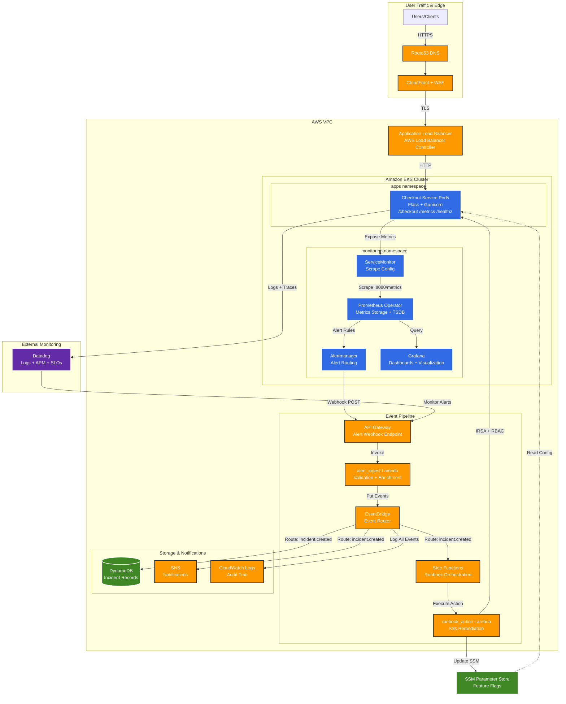
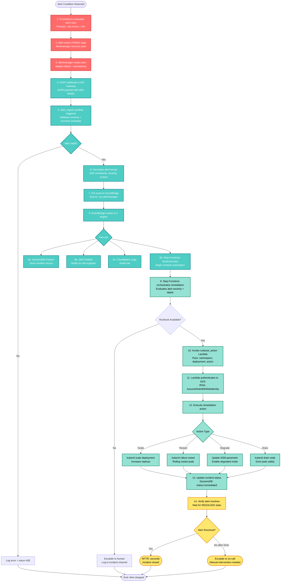
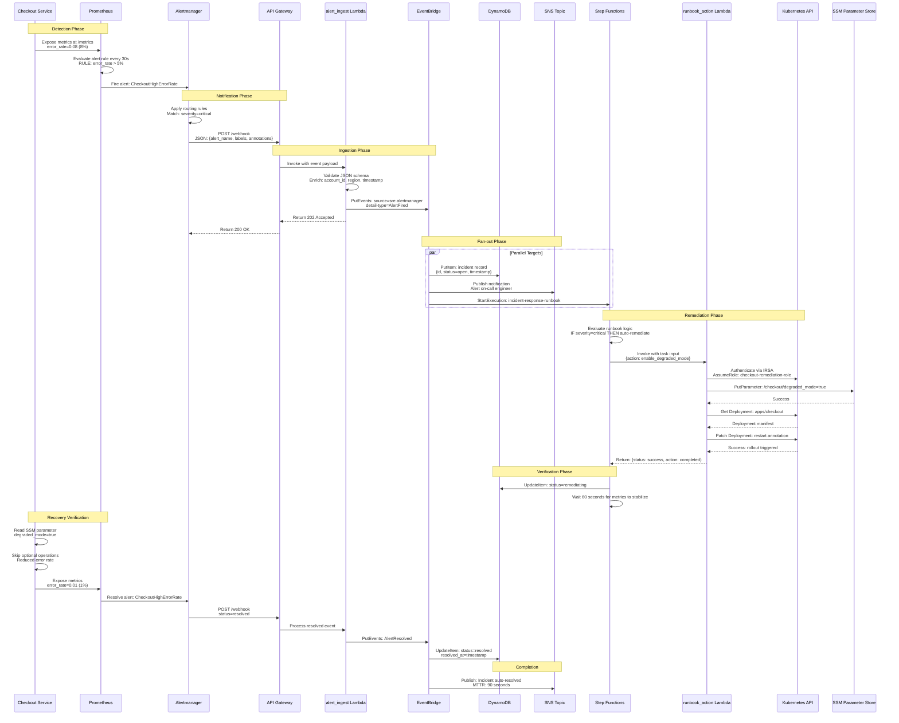
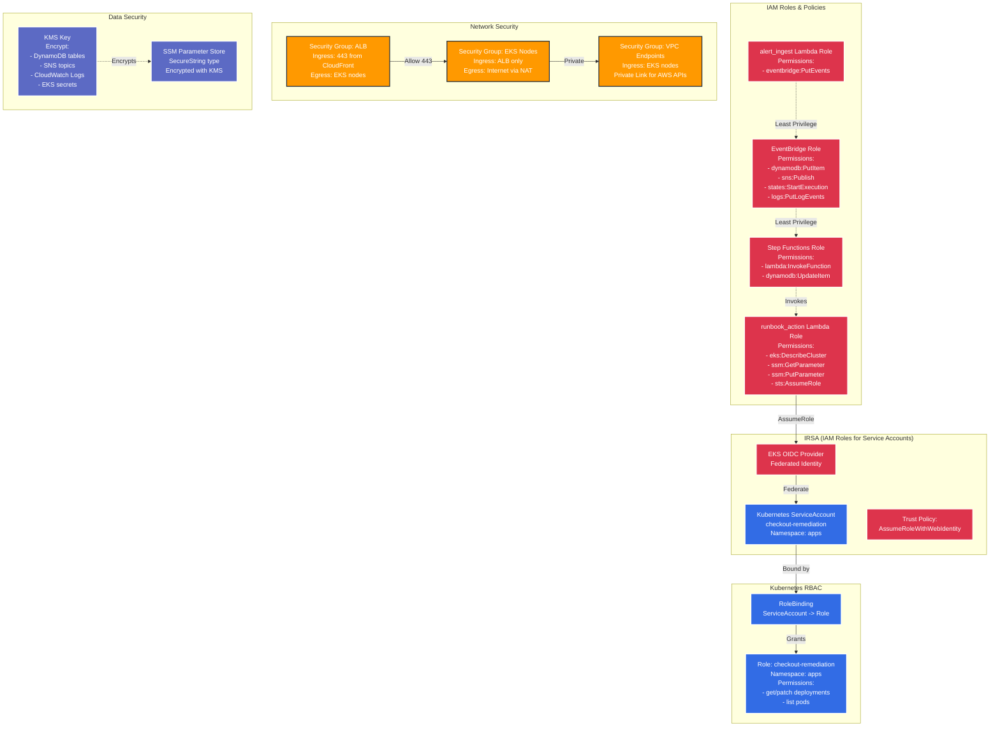

# Event-Driven SRE Platform - Architecture Documentation

## Overview

This document provides a comprehensive view of the event-driven SRE platform architecture, showing how alerts flow through the system from detection to automated remediation.

## Table of Contents

1. [High-Level Architecture](#high-level-architecture)
2. [Alert Lifecycle Flow](#alert-lifecycle-flow)
3. [Incident Response Sequence](#incident-response-sequence)
4. [Security Architecture](#security-architecture)
5. [Component Details](#component-details)

---

## High-Level Architecture

---

## Alert Lifecycle Flow

This diagram shows the numbered sequence of events from alert detection through automated remediation.

---

## Incident Response Sequence

This sequence diagram shows the interactions between components during an incident.

---

## Security Architecture

---

## Component Details

### 1. Detection Layer

**Prometheus Operator**
- Scrapes metrics from `/metrics` endpoint every 15 seconds
- Evaluates PromQL alert rules every 30 seconds
- Alert rules defined in PrometheusRule CRD
- TSDB retention: 15 days
- High availability: 2 replicas with remote write to external storage

**Alertmanager**
- Groups related alerts (reduces noise)
- Routes alerts based on severity labels
- Deduplicates alerts (5-minute window)
- Webhook integration with API Gateway
- Retry logic: 3 attempts with exponential backoff

**Datadog Monitoring** (Optional)
- APM traces for distributed tracing
- Log aggregation with structured logging
- Custom SLO monitors (availability, latency, error budget)
- Synthetics for external endpoint monitoring

### 2. Ingestion Layer

**API Gateway**
- REST API endpoint: `POST /webhook`
- Request validation: JSON schema enforcement
- Throttling: 1000 requests/second
- Authentication: API key (optional) or VPC endpoint
- Integration: Lambda proxy integration

**alert_ingest Lambda**
- Runtime: Python 3.11
- Memory: 256 MB
- Timeout: 30 seconds
- Concurrency: 100 reserved concurrent executions
- Functions:
  - Validate alert payload schema
  - Enrich with AWS metadata (account, region, timestamp)
  - Normalize alert format across sources (Alertmanager, Datadog)
  - Transform to EventBridge event format
  - Error handling: invalid alerts logged to CloudWatch

### 3. Event Routing Layer

**EventBridge**
- Custom event bus: `sre-platform-events`
- Event sources: `sre.alertmanager`, `sre.datadog`
- Event patterns for routing:
  - `incident.created` -> DynamoDB, SNS, Step Functions
  - `incident.resolved` -> DynamoDB, SNS
  - `action.completed` -> DynamoDB
- Archive: 7-day event replay capability
- Dead-letter queue: Capture failed events for retry

### 4. Orchestration Layer

**Step Functions**
- State machine: `incident-response-runbook`
- Steps:
  1. **Evaluate Alert**: Check severity and runbook eligibility
  2. **Log Incident**: Update DynamoDB status
  3. **Choose Action**: Map alert type to remediation action
  4. **Execute Action**: Invoke runbook_action Lambda
  5. **Wait for Stabilization**: 60-second delay
  6. **Verify Resolution**: Check if alert resolved
  7. **Update Status**: Mark incident as resolved or escalated
- Error handling: Exponential retry with 3 attempts
- Execution history: 90 days

**runbook_action Lambda**
- Runtime: Python 3.11
- Memory: 512 MB
- Timeout: 120 seconds
- VPC: Attached to private subnets (access to EKS API)
- Functions:
  - **enable_degraded_mode**: Update SSM parameter + rolling restart
  - **scale_deployment**: Increase replica count
  - **restart_deployment**: Force pod recreation
  - **drain_node**: Safely evict pods from unhealthy node
- IRSA: Assumes Kubernetes ServiceAccount via OIDC
- RBAC: Limited to `apps` namespace, `deployments` resource

### 5. Storage & Notification Layer

**DynamoDB**
- Table: `sre-incidents`
- Primary key: `incident_id` (UUID)
- Sort key: `timestamp` (ISO 8601)
- Attributes:
  - `alert_name`: String
  - `severity`: String (critical, warning, info)
  - `status`: String (open, remediating, resolved, escalated)
  - `labels`: Map
  - `actions_taken`: List
  - `resolved_at`: Number (Unix timestamp)
- Encryption: KMS
- Point-in-time recovery: Enabled
- TTL: 90 days (auto-delete old incidents)

**SNS Topic**
- Topic: `sre-incident-notifications`
- Subscriptions:
  - Email: On-call engineer
  - Slack webhook: Incident channel
  - PagerDuty: Critical alerts only (filtered)
- Message filtering: Severity-based routing
- Delivery retry: 3 attempts over 10 minutes

**CloudWatch Logs**
- Log groups:
  - `/aws/lambda/alert-ingest`
  - `/aws/lambda/runbook-action`
  - `/aws/states/incident-response-runbook`
- Retention: 30 days
- Insights queries: Pre-built dashboards for MTTR, alert volume
- Metric filters: Extract custom metrics (remediation success rate)

### 6. Application Layer

**Checkout Service**
- Framework: Flask + Gunicorn
- Replicas: 3 (horizontal pod autoscaling)
- Resources:
  - Requests: 100m CPU, 128Mi memory
  - Limits: 500m CPU, 512Mi memory
- Health checks:
  - Liveness: `/healthz` (timeout 5s)
  - Readiness: `/healthz` (failure threshold 3)
- Metrics: Prometheus client library
  - Counters: `checkout_requests_total`, `checkout_errors_total`
  - Histograms: `checkout_request_duration_seconds`
  - Gauges: `checkout_degraded_mode_enabled`
- Chaos engineering:
  - `LATENCY_MS`: Inject artificial latency
  - `ERROR_RATE`: Random error injection (0.0-1.0)
  - `DEGRADED_MODE`: Disable optional features

---

## Key Design Decisions

### 1. Serverless Event Pipeline
**Decision**: Use Lambda + EventBridge instead of EKS-hosted services
**Rationale**:
- Lower operational overhead (no pods to manage)
- Auto-scaling without capacity planning
- Pay-per-use pricing for bursty alert traffic
- Built-in retry and error handling

**Trade-offs**:
- Cold start latency (mitigated with reserved concurrency)
- Vendor lock-in to AWS
- Debugging across distributed services

### 2. IRSA for Kubernetes Access
**Decision**: Use IAM Roles for Service Accounts instead of long-lived credentials
**Rationale**:
- No secrets to rotate or leak
- Temporary credentials (1-hour expiration)
- Audit trail in CloudTrail
- Fine-grained permissions per namespace

**Trade-offs**:
- Complex initial setup (OIDC provider)
- Requires EKS 1.13+

### 3. EventBridge as Central Bus
**Decision**: Route all events through EventBridge instead of direct integrations
**Rationale**:
- Decouples producers and consumers
- Easy to add new targets without code changes
- Built-in event filtering and transformation
- Event replay for debugging

**Trade-offs**:
- Additional latency (10-50ms)
- Event payload size limit (256 KB)

### 4. Step Functions for Orchestration
**Decision**: Use Step Functions instead of custom Lambda orchestration
**Rationale**:
- Visual workflow editor
- Built-in error handling and retries
- State persistence (no external database needed)
- Execution history for compliance

**Trade-offs**:
- Cost at high scale ($25 per 1M state transitions)
- Limited to 25,000 execution history
- ASL (Amazon States Language) learning curve

---

## Observability & Monitoring

### Metrics Collected
- **Application metrics**: Request rate, error rate, latency (p50, p95, p99)
- **Pipeline metrics**: Alert ingestion rate, remediation success rate, MTTR
- **Infrastructure metrics**: Pod CPU/memory, node capacity, Lambda duration

### Dashboards
- **SRE Dashboard**: Real-time incident status, alert volume, remediation actions
- **Application Dashboard**: Service health, error rate trends, latency heatmaps
- **Cost Dashboard**: Lambda invocations, EventBridge events, DynamoDB consumption

### Alerts on the Alerting System
- **Meta-monitoring**: Alert if alert_ingest Lambda errors > 1%
- **Pipeline health**: Alert if EventBridge delivery failures > 5%
- **Remediation failures**: Alert if runbook_action Lambda fails 3 times in 10 minutes

---

## Disaster Recovery

### Failure Scenarios

**Scenario 1: alert_ingest Lambda fails**
- Impact: Alerts not ingested, no remediation
- Detection: CloudWatch alarm on Lambda errors
- Mitigation: Alertmanager retries webhook (3 attempts), DLQ captures failed events
- Recovery: Replay events from EventBridge archive

**Scenario 2: EKS API unreachable**
- Impact: Remediation actions fail
- Detection: runbook_action Lambda timeout
- Mitigation: Step Functions retry (3 attempts, exponential backoff)
- Escalation: SNS notification to on-call after retries exhausted

**Scenario 3: EventBridge target failure**
- Impact: Incidents not logged to DynamoDB
- Detection: CloudWatch metric filter on failed PutItem
- Mitigation: EventBridge DLQ captures failed events
- Recovery: Reprocess events from DLQ

**Scenario 4: DynamoDB table deleted**
- Impact: No incident history
- Detection: Terraform state drift
- Mitigation: Point-in-time recovery (restore from backup)
- Prevention: Enable deletion protection on table

---

## Scalability Considerations

### Current Limits
- Alert ingestion: 1000 alerts/second (API Gateway throttle)
- Concurrent remediations: 100 (Lambda reserved concurrency)
- Event throughput: 10,000 events/second (EventBridge soft limit)
- Incident storage: Unlimited (DynamoDB auto-scaling)

### Scaling Strategies
1. **Horizontal scaling**: Increase Lambda concurrency
2. **Batching**: Group alerts in 5-second windows to reduce invocations
3. **Caching**: Cache EKS cluster info in Lambda environment variables
4. **Sharding**: Separate event buses per region or environment

---

## Cost Optimization

### Monthly Cost Estimate (1000 alerts/day)
- API Gateway: 30M requests × $3.50/M = $105
- Lambda (alert_ingest): 30M invocations × 100ms × $0.20/M = $6
- Lambda (runbook_action): 1000 invocations × 5s × $0.20/M = $0.10
- EventBridge: 30M events × $1.00/M = $30
- Step Functions: 1000 executions × 5 transitions × $25/M = $0.13
- DynamoDB: 1000 writes/day × $1.25/M = $0.04
- SNS: 1000 notifications × $0.50/M = $0.0005
- **Total: ~$141/month**

### Optimization Techniques
- Use VPC endpoints to avoid API Gateway costs (NAT Gateway cheaper at high volume)
- Reduce Lambda memory if not needed (alert_ingest can use 128 MB)
- Use EventBridge input transformers to reduce Step Functions state transitions
- Archive old DynamoDB incidents to S3 (Glacier for long-term storage)

---

## Security Best Practices Implemented

- ✅ Least-privilege IAM policies (no wildcards for application resources)
- ✅ Encryption at rest (KMS for all data stores)
- ✅ Encryption in transit (TLS 1.2+ for all endpoints)
- ✅ IRSA instead of long-lived credentials
- ✅ Kubernetes RBAC (namespace-scoped roles)
- ✅ VPC security groups (allow-list only)
- ✅ CloudTrail logging (API audit trail)
- ✅ Secrets management (SSM Parameter Store with KMS)
- ✅ Container image scanning (ECR scan on push)
- ✅ Network segmentation (private subnets for EKS)

---

## Future Enhancements

### Short-term (Next Sprint)
- Add more runbook actions (canary deployment, traffic shift)
- Implement alert correlation (group related alerts)
- Add Slack bot for interactive remediation approval
- Create Terraform module for multi-region deployment

### Medium-term (Next Quarter)
- Machine learning for anomaly detection
- Automated rollback if remediation causes further degradation
- SLO-based alerting (error budget exhaustion)
- Cost anomaly detection and auto-scaling

### Long-term (Next Year)
- Multi-cloud support (GCP, Azure)
- Chaos engineering platform integration (Gremlin, Chaos Mesh)
- Self-healing infrastructure (auto-replace unhealthy nodes)
- Predictive alerting (forecast incidents before they occur)

---

## References

- [AWS Lambda Best Practices](https://docs.aws.amazon.com/lambda/latest/dg/best-practices.html)
- [EKS IRSA Documentation](https://docs.aws.amazon.com/eks/latest/userguide/iam-roles-for-service-accounts.html)
- [EventBridge Event Patterns](https://docs.aws.amazon.com/eventbridge/latest/userguide/eb-event-patterns.html)
- [Prometheus Alert Rules](https://prometheus.io/docs/prometheus/latest/configuration/alerting_rules/)
- [Step Functions Error Handling](https://docs.aws.amazon.com/step-functions/latest/dg/concepts-error-handling.html)

---

**Last Updated**: 2026-02-02
**Maintained By**: SRE Platform Team
